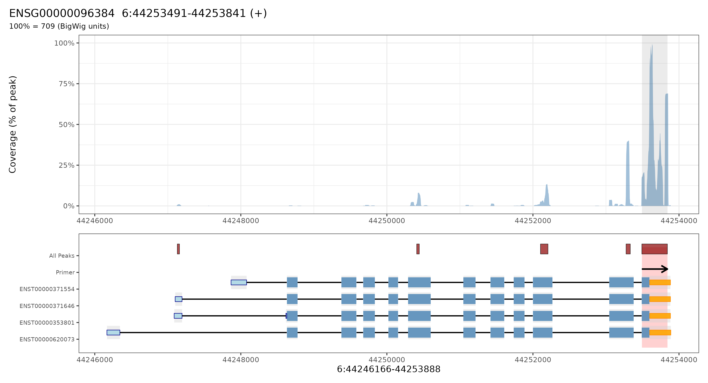

<table>
  <tr>
  <td></td>
    <td style="vertical-align: middle;"><h1 style="margin:0; padding-left:20px;">PeakPrime — MACS2-based 3'end RNA-seq primer design pipeline</h1></td>
  </tr>
</table>

PeakPrime is a Nextflow pipeline that uses **MACS2 peak calling** to identify high-coverage regions in (3' end) RNA-seq data and designs strand-specific cDNA primers with comprehensive quality control and visualization.

## 🔬 Why PeakPrime?

- **Peak-based target identification**: Uses MACS2 to find statistically significant coverage peaks
- **MACS2-aware quality control**: Integrates peak scores, q-values, and exonic overlap metrics
- **Strand-specific primer design**: Ensures primers are appropriate for cDNA amplification
- **Comprehensive visualization**: Coverage plots with peak overlays and all-peaks visualization
- **Optional transcriptome QC**: Bowtie2-based specificity checks to detect cross-reactivity

## 🚀 Pipeline Overview

### Core Workflow
1. **Peak calling**: MACS2 identifies significant coverage peaks from RNA-seq BAM files
2. **Peak processing**: Filters peaks by quality metrics and exonic overlap
3. **Target window selection**: Selects optimal regions around high-quality peaks
4. **Primer design**: Uses Primer3 to generate strand-appropriate primer pairs
5. **Quality control**: Optional transcriptome alignment to assess specificity
6. **Visualization**: Generates publication-ready coverage plots with peak annotations

### Key Features
- **MACS2 integration**: Leverages statistical peak calling for robust target identification
- **Multiple QC strategies**: Peak score thresholds, p-value filtering, exonic fraction requirements
- **Advanced visualization**: Shows coverage, gene structure, primers, and all peaks in context
- **Flexible parameters**: Configurable peak calling, quality thresholds, and primer design settings

## 📋 Requirements

- **Nextflow** (≥22.04.0)
- **Conda/Mamba** for environment management
- **Input files**:
  - RNA-seq BAM file (indexed)
  - GTF annotation file
  - Gene list (one Ensembl gene ID per line)
  - Primer3 settings file

## 🛠️ Installation

```bash
git clone https://github.com/OncoRNALab/PeakPrime.git 
```

## 🚀 Quick Start

### Basic Primer Design
```bash
nextflow run main.nf \
  --bam sample.bam \
  --gtf annotations.gtf \
  --genes gene_list.txt \
  --outdir results/ \
  -profile local
```

### With Custom MACS2 Parameters
```bash
nextflow run main.nf \
  --bam sample.bam \
  --gtf annotations.gtf \
  --genes gene_list.txt \
  --macs2_qvalue_threshold 0.01 \
  --macs2_min_peak_score 10 \
  --outdir results/ \
  -profile local
```

### With Custom Fragment Size and Shift
```bash
# For 3' RNA-seq data or low-coverage samples (< 1M reads), specify fragment extension and shift
# WARNING: Only use these parameters for special cases - standard RNA-seq should use auto-detection
nextflow run main.nf \
  --bam sample.bam \
  --gtf annotations.gtf \
  --genes gene_list.txt \
  --macs2_extsize 50 \
  --macs2_shift -25 \
  --outdir results/ \
  -profile local
```

### Use Second-Best Peaks
```bash
# Select second-best peaks instead of the best peaks per gene
nextflow run main.nf \
  --bam sample.bam \
  --gtf annotations.gtf \
  --genes gene_list.txt \
  --peak_rank 2 \
  --outdir results_second_best/ \
  -profile local
```

### Generate Visualization Plots

#### Option 1: Combined mode (primer design + plotting)
```bash
# Run primer design AND generate plots in one command
nextflow run main.nf --makeplots \
  --bam sample.bam \
  --gtf annotations.gtf \
  --genes gene_list.txt \
  --outdir results/
```

#### Option 2: Standalone plotting mode (using pre-existing files)
```bash
# Generate plots from previous pipeline run results
nextflow run main.nf --makeplots \
  --bw results/sample.bam.bw \
  --gtf annotations.gtf \
  --genes gene_list.txt \
  --peaks_tsv results/selected_peaks.tsv \
  --qc_tsv results/peaks_qc_summary.tsv \
  --primer_targets_bed results/primer_targets.bed \
  --narrowpeak results/macs2_peaks/sample_peaks.narrowPeak \
  --outdir plots/ \
  -profile local
```

## ⚙️ Parameters

### Required Parameters
| Parameter | Description |
|-----------|-------------|
| `--bam` | RNA-seq BAM file (must be indexed) |
| `--gtf` | Gene annotation GTF file |
| `--genes` | Text file with one Ensembl gene ID per line |

### MACS2 Peak Calling Parameters
| Parameter | Default | Description |
|-----------|---------|-------------|
| `--macs2_qvalue_threshold` | 0.05 | Q-value (FDR) threshold for peak significance (controls both MACS2 calling and pipeline filtering) |
| `--macs2_min_peak_score` | 0 | Minimum peak score threshold |
| `--macs2_extsize` | null | Fragment size for extending reads (--extsize), null for auto-detection |
| `--macs2_shift` | null | Shift for reads in bp (--shift), null for auto-detection |

#### MACS2 Command Modes

**Default mode** (when `macs2_extsize` is null):
```bash
macs2 callpeak -t file.bam -g hs --bdg --keep-dup auto -q 0.05
```

**Fragment modeling mode** (when `macs2_extsize` is specified):
```bash
macs2 callpeak -t file.bam -g hs --bdg --keep-dup auto -q 0.05 --nomodel --extsize 50 --shift 0 --call-summits
```
| `--peak_selection_metric` | score | Metric for selecting best peak per gene: 'score' or 'qvalue' |
| `--peak_rank` | 1 | Which ranked peak to select per gene: 1 for best, 2 for second-best, etc. |

> **📝 Parameter Migration Note**: The parameter `--macs2_pvalue_threshold` has been replaced with `--macs2_qvalue_threshold` for statistical consistency. The old parameter is still accepted for backward compatibility but will show a deprecation warning.

> **⚠️ Important:** The `--macs2_extsize` and `--macs2_shift` parameters enable MACS2's `--nomodel` mode, which should only be used in special cases:
> - **Low-coverage data** (< 1M mapped reads)
> - **Specific protocols** where exact fragment sizes are known
> - **Troubleshooting** when MACS2's automatic model building fails (always visualy inspect the automatic default macs2 called peaks)
> 
> For most standard RNA-seq experiments, leave these parameters as `null` to allow MACS2's automatic fragment size estimation, which typically provides better results.

### Primer Design Parameters
| Parameter | Default | Description |
|-----------|---------|-------------|
| `--primer3_settings` | config/primer3_settings.txt | Primer3 configuration file |
| `--genome_package` | BSgenome.Hsapiens.UCSC.hg38 | R/Bioconductor genome package |
| `--fasta` | null | Genome FASTA file (alternative to BSgenome) |

### Quality Control Parameters
| Parameter | Default | Description |
|-----------|---------|-------------|
| `--min_exonic_fraction` | null | Minimum required exonic fraction (0-1) |
| `--trim_to_exon` | false | Trim final window to exon containing the peak |
| `--force_exonic_trimming` | true | **Force trimming to exon+UTR boundaries for primer safety** |
| `--min_trimmed_length` | 150 | Minimum length of trimmed region for primer design (bp) |
| `--search_slop` | 1000 | Extra bases for BigWig import |

> **📝 Note**: This pipeline uses MACS2 for statistically rigorous peak calling. Legacy parameters from previous derfinder-based implementations (`pad`, `smooth_k`, `sliding_window`, `trim_low_coverage_pct`) are no longer used in the current workflow architecture.

> **🔒 Primer Safety**: By default, `--force_exonic_trimming` is enabled to ensure all primers target transcribed regions only, never regulatory DNA upstream/downstream of genes. This prevents primers from binding to enhancers, promoters, or other regulatory elements. To disable this safety feature, set `--force_exonic_trimming false`.

### Transcriptome Alignment QC (Optional)
| Parameter | Description |
|-----------|-------------|
| `--transcriptome_index` | Bowtie2 transcriptome index prefix |
| `--transcriptome_fasta` | Transcriptome FASTA for gene mapping |
| `--max_primers_per_gene` | Maximum primers per gene for QC (default: 20) |

### Plotting Parameters (for --makeplots mode)
| Parameter | Description |
|-----------|-------------|
| `--bw` | BigWig coverage file |
| `--peaks_tsv` | Selected peaks TSV file |
| `--qc_tsv` | QC summary TSV file |
| `--primer_targets_bed` | Primer targets BED file |
| `--narrowpeak` | MACS2 narrowPeak file (for all-peaks visualization) |

## 📁 Output Files

### Main Pipeline Outputs

#### Peak Calling Results
- `macs2_peaks/`: MACS2 output directory
  - `*_peaks.narrowPeak`: Detected peaks in narrowPeak format
  - `*_summits.bed`: Peak summits
  - `*_peaks.xls`: Detailed peak information

#### Selected Targets
- `selected_peaks.tsv`: Final selected peak windows with coordinates and QC metrics
- `primer_targets.bed`: Target regions in BED format
- `primer_targets.fa`: Target sequences in FASTA format

#### Quality Control
- `peaks_qc_summary.tsv`: Comprehensive QC metrics for each gene:
  - Peak scores, p-values, q-values
  - Exonic fraction calculations
  - Coverage statistics
  - Selection strategy used

#### Primer Design Results
- `primer3_input.txt`: Formatted Primer3 input
- `primer3_output.txt`: Raw Primer3 results
- `cdna_primers.tsv`: Final strand-appropriate primer pairs

#### Coverage Data
- `*.bam.bw`: BigWig coverage files for visualization

#### Pipeline Summary
- `pipeline_summary.txt`: Comprehensive summary of pipeline results including:
  - Total genes processed
  - Genes with/without selected peaks
  - Genes with primer sequences generated
  - Genes with uniquely aligned primers (if transcriptome QC enabled)
  - Failure reasons for genes without peaks

### Transcriptome QC Outputs (if enabled)
- `primers_for_alignment.fa`: Primer sequences for alignment
- `primers_alignment.bam`: Bowtie2 alignment results
- `primer_alignment_report.tsv`: Specificity classification per primer
- `primer_alignment_summary.tsv`: Detailed alignment information

### Visualization Outputs (--makeplots mode)
- `plot_<gene_id>.png`: Coverage plots with gene structure and peaks

## 📊 Visualization Features

The pipeline generates comprehensive visualization plots showing:

### Coverage Plot (Top Panel)
- **RNA-seq coverage**: Area plot across the entire gene
- **Selected window**: Highlighted region chosen for primer design
- **QC metrics**: Peak scores, p-values, and coverage statistics in subtitle

### Feature Plot (Bottom Panel)
- **Gene structure**: All isoforms with exons (blocks) and introns (lines)
- **Primer locations**: Arrows showing designed primer positions
- **All MACS2 peaks**: Horizontal bars showing all detected peaks within the gene
- **Peak intensity**: Color-coded by peak score/significance

### Example Visualization
```bash
# Generate plot for a single gene
Rscript bin/MakePlots_new.R \
  --gene ENSG00000067191 \
  --bw results/sample.bam.bw \
  --gtf annotations.gtf \
  --peaks results/selected_peaks.tsv \
  --qc results/peaks_qc_summary.tsv \
  --primer results/primer_targets.bed \
  --narrowpeak results/macs2_peaks/sample_peaks.narrowPeak \
  --out ENSG00000067191_with_peaks.png
```

### Example Pipeline Summary
```bash
# Generate summary report for pipeline results
python bin/summarize_pipeline_results.py results/your_output_directory/
```

#### Sample Plot Output


*Example visualization showing RNA-seq coverage (top), gene structure with UTRs, primer locations, and all MACS2 peaks (bottom) for gene ENSG00000096384. The selected peak window is highlighted, and all detected peaks within the gene are shown as colored bars indicating their significance.*

**Color Legend:**
- **Coverage plot**: Blue area shows RNA-seq read coverage
- **Gene structure**: 
  - Gray bars: Full exonic regions (transcribed areas)
  - Blue bars: CDS regions (coding sequences)  
  - Light blue bars: 5' UTRs
  - Orange bars: 3' UTRs
- **Primers**: Red arrows indicate the primer direction
- **MACS2 peaks**: Horizontal bars colored by peak score/significance (darker = higher significance)
- **Selected window**: Yellow/highlighted region chosen for primer design

## 🔧 Quality Control Features

### MACS2-Based Peak Selection
- **Statistical significance**: Uses MACS2 p-values and q-values for peak filtering
- **Peak scoring**: Considers peak scores for quality assessment
- **Reproducible peak calling**: Consistent statistical framework across samples

### Advanced QC Metrics
- **Exonic overlap**: Calculates fraction of peak overlapping exonic sequences
- **Coverage validation**: Ensures selected regions have adequate coverage depth
- **Peak quality thresholds**: Configurable p-value and score cutoffs

### Primer Quality Assessment
- **Strand specificity**: Ensures primers match mRNA orientation for cDNA
- **Transcriptome specificity**: Optional cross-reactivity assessment
- **Quality classification**: PERFECT/GOOD/MODERATE/POOR/FAIL scoring

## 🧬 Biological Rationale

### Peak-Based Target Selection
- Uses statistically significant coverage peaks rather than arbitrary high-coverage regions
- Ensures targets represent genuine transcriptional hotspots
- Provides quantitative measures of peak significance

### Strand-Specific Primer Design
- Selects primers appropriate for cDNA amplification
- Considers gene strand orientation for proper primer placement
- Ensures compatibility with reverse transcription workflows

## 📝 Example Configuration Files

### Gene List Format (`gene_list.txt`)
```
ENSG00000067191
ENSG00000089009
ENSG00000108468
```

### Primer3 Settings (`config/primer3_settings.txt`)
```
PRIMER_PRODUCT_SIZE_RANGE=75-150
PRIMER_NUM_RETURN=5
PRIMER_OPT_SIZE=20
PRIMER_MIN_SIZE=18
PRIMER_MAX_SIZE=25
PRIMER_OPT_TM=60.0
PRIMER_MIN_TM=57.0
PRIMER_MAX_TM=63.0
PRIMER_MIN_GC=20.0
PRIMER_MAX_GC=80.0
PRIMER_MAX_POLY_X=4
PRIMER_SALT_MONOVALENT=50.0
PRIMER_DNA_CONC=50.0
PRIMER_MAX_NS_ACCEPTED=0
PRIMER_MAX_SELF_ANY=12
PRIMER_MAX_SELF_END=8
PRIMER_PAIR_MAX_COMPL_ANY=12
PRIMER_PAIR_MAX_COMPL_END=8
=
```

## 🔍 Troubleshooting

### Common Issues

1. **No peaks detected**
   - Check MACS2 p-value threshold (try relaxing to 0.1)
   - Verify sufficient coverage depth in input BAM
   - Ensure genes are present in the BAM file

2. **Peaks fail QC**
   - Adjust exonic fraction requirements
   - Check peak score thresholds
   - Review coverage smoothing parameters

3. **Memory issues**
   - Increase process memory in nextflow.config
   - Use appropriate computational profile (local vs pbs)

4. **Visualization issues**
   - Ensure BigWig files exist from main pipeline
   - Check file paths in plotting commands
   - Verify all required R packages are installed

### Performance Tips

1. **Optimize MACS2 parameters** for your data type and depth
2. **Use appropriate computational profiles** (local for small datasets, pbs for large)
3. **Pre-filter gene lists** to focus on genes of interest
4. **Adjust memory allocations** based on your system capabilities

## 🏗️ Profiles

### Local Profile
```bash
nextflow run main.nf -profile local [other options]
```
- Uses local execution
- Suitable for small datasets or testing
- Default memory: 4 GB per process

### PBS Profile
```bash
nextflow run main.nf -profile pbs [other options]
```
- Uses PBS job scheduler
- Suitable for HPC environments
- Configurable resource requirements

## 📚 Citation

If you use Primer PeakFindR in your research, please cite:

- **MACS2**: Zhang et al. (2008) Model-based Analysis of ChIP-Seq (MACS). *Genome Biology*
- **Nextflow**: Di Tommaso et al. (2017) Nextflow enables reproducible computational workflows. *Nature Biotechnology*
- **Primer3**: Untergasser et al. (2012) Primer3—new capabilities and interfaces. *Nucleic Acids Research*

## 🤝 Contributing

Contributions are welcome! Please feel free to submit issues, feature requests, or pull requests.

## 📄 License

This pipeline is available under [appropriate license].
